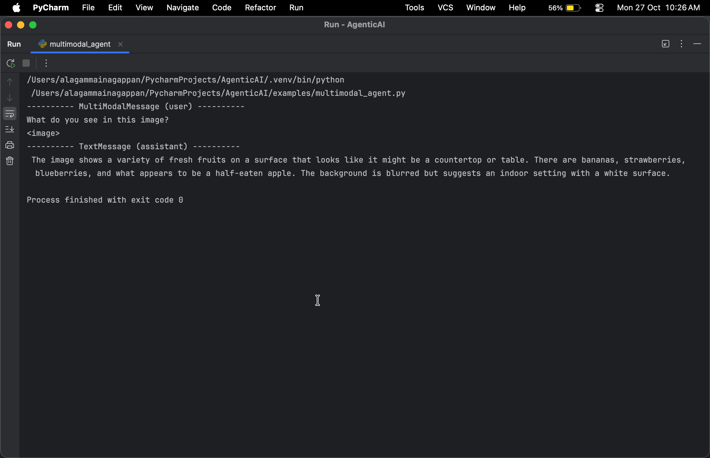
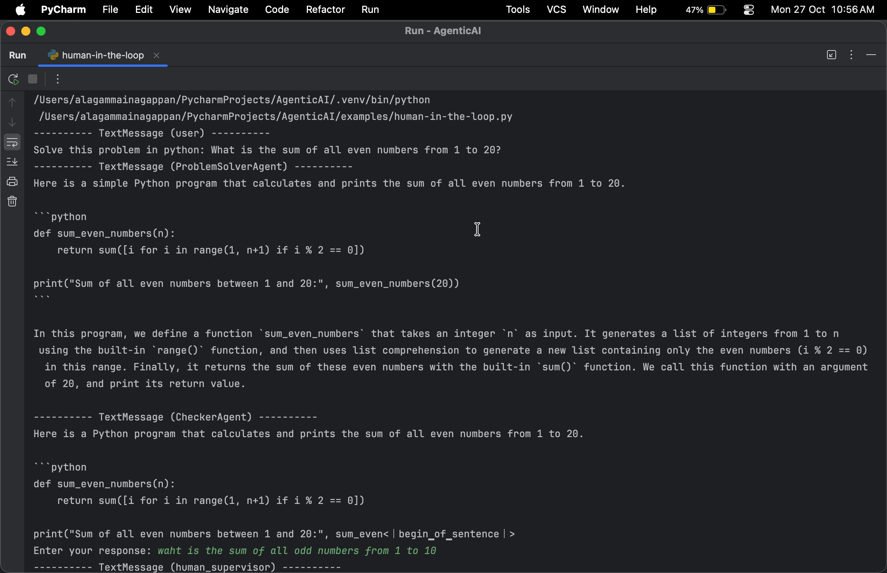
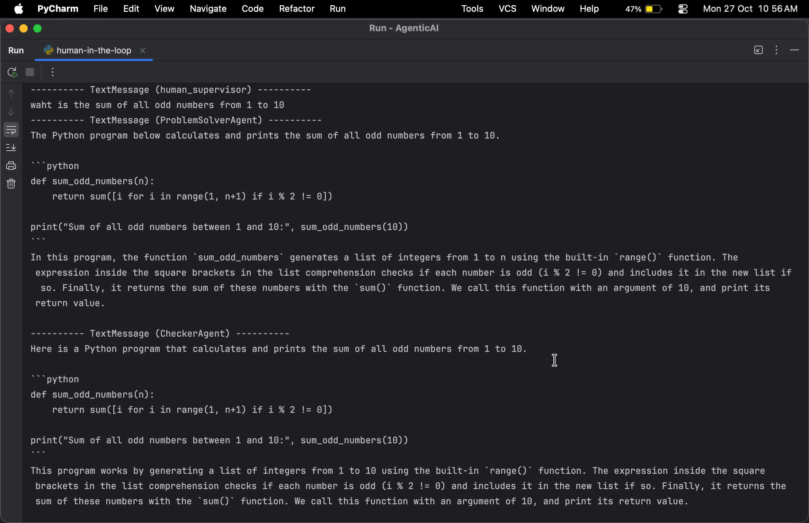
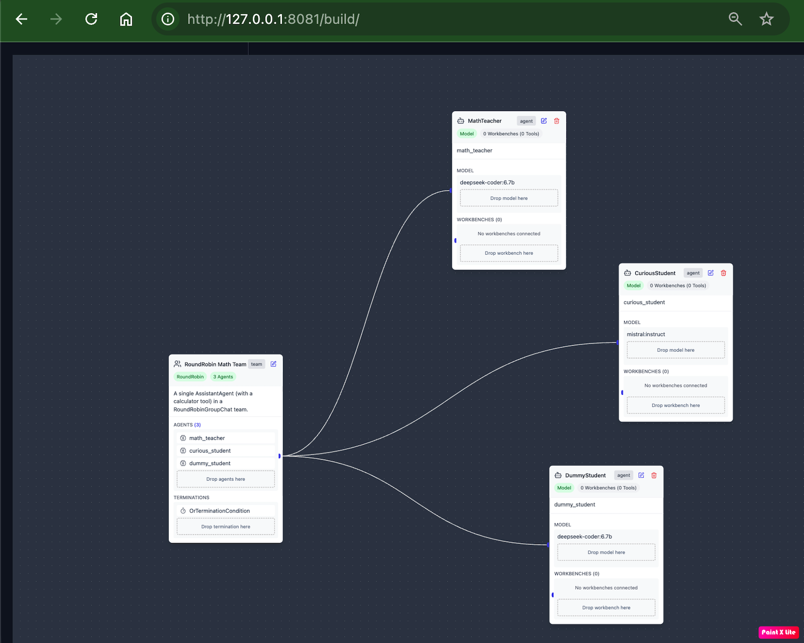

# 🤖 AgenticAI Demos – AutoGen + Ollama + Multi-Agent Systems

This repository showcases **Agentic AI examples** using AutoGen, Ollama, and local models like DeepSeek and LLaVA.  
It includes single-agent, multi-agent, multimodal (vision + text), and human-in-the-loop QA testing examples.

---

## 🌟 Example Scripts

| Script | Description | 
|--------|-------------|
| `single_agent.py` | Single-agent demo using DeepSeek for code/text tasks |
| `multi-agent.py` | Multi-agent (Round Robin) demo – teacher & student agents |
| `multimodal_agent.py` | Vision + text processing using LLaVA         | 
| `human-in-the-loop.py` | QA workflow where one agent validates another | 


---
##  🧩 Highlights

---
🧠 Multi Agent coordination (teacher ↔ student - DeepSeek model)
🖼 Vision + text understanding (LLaVA)


💬 Multimodal Agent (Vision - LLaVA model)


🧪 Human-in-the-loop QA testing (DeepSeek model))




🧰 Fully integrated with Ollama local inference

## 🚀 Quick Setup (PyCharm + Ollama)

---
1. **Clone the repository**

```bash
git clone https://github.com/<yourusername>/AgenticAI-Demos.git
cd AgenticAI-Demos


2. **Run installation  script**
 (creates virtual environment, installs dependencies, pulls Ollama model, starts server)

source ./activate_env.sh
bash setup.sh
agstudio  - run this to bring up autogen studio 

The setup script runs Ollama in the background. Keep it running while executing examples.

3. **Run any example in PyCharm**

Go to examples folder -> Open the script in PyCharm.

Ensure the interpreter points to .autogen venv.

Run the script using Run → Run 'script_name' or python3 script_name

.
🧠 Load the AutoGen Studio Project

The repository includes a sample AutoGen Studio team project:

📂 autogen-studio/.autogenstudio/teams/math_classroom_team.json

To load it:

Open AutoGen Studio (via agstudio )

Go to Teams → Import / Load Team

Select the above JSON file

Click Load → then Start Chat

🧪 Autogen Studio classroom team  QA testing (DeepSeek model))


