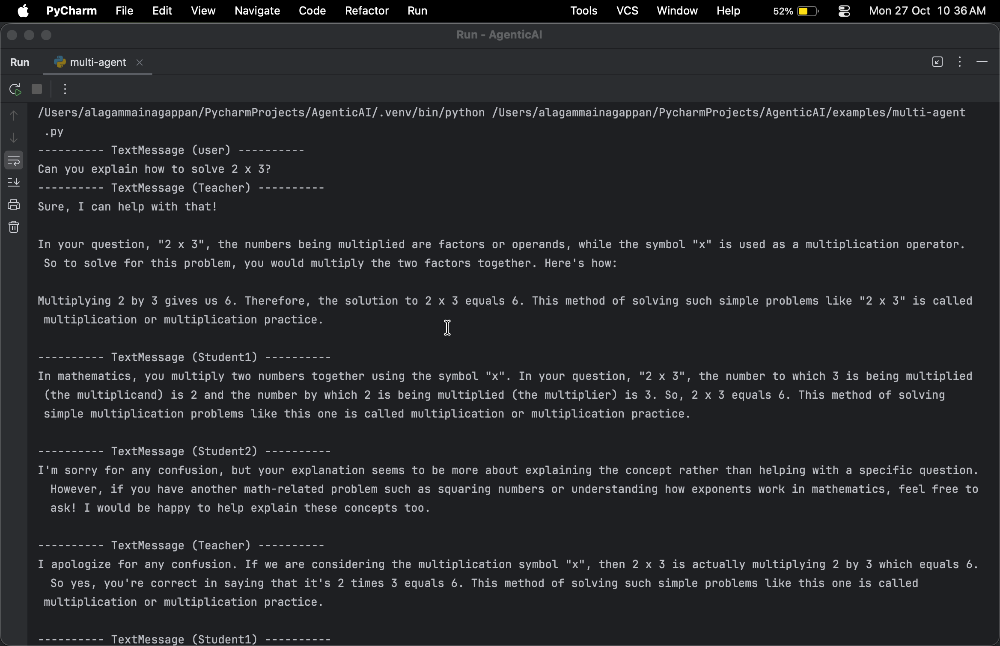

# 🤖 AgenticAI Demos – AutoGen + Ollama + Multi-Agent Systems

This repository showcases **Agentic AI examples** using AutoGen, Ollama, and local models like DeepSeek and LLaVA.  
It includes single-agent, multi-agent, multimodal (vision + text), and human-in-the-loop QA testing examples.

---

## 🌟 Example Scripts

| Script | Description | 
|--------|-------------|
| `single_agent.py` | Single-agent demo using DeepSeek for code/text tasks |
| `multi-agent.py` | Multi-agent (Round Robin) demo – teacher & student agents |
| `multimodal_agent.py` | Vision + text processing using LLaVA         | 
| `human-in-the-loop.py` | QA workflow where one agent validates another | 


---
##  🧩 Highlights

---
🧠 Multi Agent coordination (teacher ↔ student - DeepSeek model)
🖼 Vision + text understanding (LLaVA)


💬 Multimodal Agent (Vision - LLaVA model)


🧪 Human-in-the-loop QA testing (DeepSeek model))


🧰 Fully integrated with Ollama local inference

## 🚀 Quick Setup (PyCharm + Ollama)

---
## 1. Clone the Repository
```bash
git clone https://github.com/<yourusername>/AgenticAI-Demos.git
cd AgenticAI-Demos


2. Run installation script

(creates virtual environment, installs dependencies, pulls Ollama model, starts server)

source ./activate_env.sh
bash setup.sh
agstudio   # run this to bring up AutoGen Studio

The setup script runs Ollama in the background. Keep it running while executing examples.

3. Run any example in PyCharm

Go to examples folder → open the script in PyCharm

Ensure the interpreter points to .autogen venv

Run the script using:
python3 script_name.py

or Run → Run 'script_name'

i🧠 Load the AutoGen Studio Project

The repository includes a sample AutoGen Studio team project:

📂 autogen-studio/.autogenstudio/teams/math_classroom_team.json

To load it:
Open AutoGen Studio (agstudio)
Go to Teams → Import / Load Team
Select the above JSON file
Click Load
Then click Start Chat


🧪 Human-in-the-loop AI Interviewer Wrokflow  (llama3.2:1b model))


🧪 Autogen Studio classroom team  QA testing (DeepSeek model))


